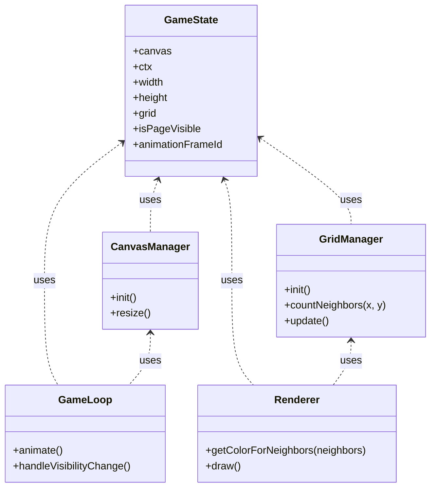

# Conway's Game of Life

An interactive implementation of Conway's Game of Life using HTML5 Canvas with the following features:
- Responsive grid that adapts to window size
- Color-coded cells based on neighbor count
- Toroidal array implementation (edges wrap around)
- Page visibility optimization (pauses when tab is inactive)

## Implementation Details

The game is built using vanilla JavaScript with classes handling different aspects:
- [`GameState`](script.js): Manages the application state
- [`GridManager`](script.js): Handles grid initialization and game rules
- [`CanvasManager`](script.js): Controls canvas setup and resizing
- [`Renderer`](script.js): Responsible for drawing cells with dynamic coloring
- [`GameLoop`](script.js): Manages animation and page visibility



## Getting Started

1. Clone the repository
2. Open [index.html](index.html) in a web browser
3. Watch the Game of Life evolve!

## Contributing

Contributions are welcome! Here are some ways you can contribute:

1. Fork the repository
2. Create a feature branch (`git checkout -b feature/amazing-feature`)
3. Commit your changes (`git commit -m 'Add amazing feature'`)
4. Push to the branch (`git push origin feature/amazing-feature`)
5. Open a Pull Request

### Development Setup

The project uses a simple structure:
- [index.html](index.html): Main entry point
- [script.js](script.js): Game logic and classes
- [styles.css](styles.css): Basic styling
- [.github/workflows/main.yaml](.github/workflows/main.yaml): GitHub Pages deployment

## License

This project is open source and available under the MIT License.
Appending text


## The Algorithm:

```
In cells both square and stark, a world unfolds,
Where binary fates dance through time and space.
Each neighbor counted, as the rule holds,
Two or three companions set life's pace.

With fewer friends, the lonely cell must fade,
While crowds of four or more bring certain death.
But three dear neighbors see new life be made,
As empty spaces draw their first sweet breath.

Through toroidal bounds the grid extends,
Where edges wrap like ancient snake of lore.
Each generation's story gently bends,
As patterns shift from less to more.

Thus Conway's game, in pure simplicity,
Shows how complexity breeds endlessly.
```

## The Algorithm (In Sonnet Form)

In grids of cells both stark and binary,
Each space decides 'tween life and death's dark call.
Two neighbors keep what living cells carry,
While three preserve or birth life overall.

The GridManager counts eight spaces near,
Each cell alive adds weight to sum divine.
When four or more crowd close, death draws so near,
While loneliness lets single cells decline.

In toroidal dance edges wrap complete,
As east meets west and north joins southern bound.
Through generations patterns repeat,
As gliders glide and blinkers blink around.

Through simple rules complexity emerges,
As life and death in endless dance converges.
